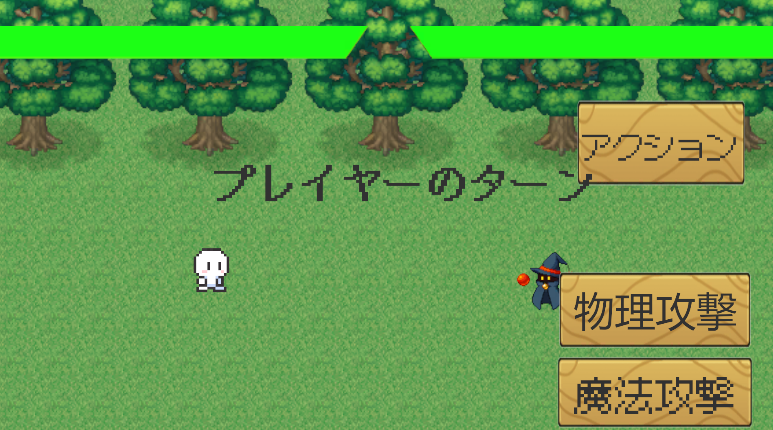

# 概要
タイミングよく画面のボタンを押すことで，敵の攻撃を避けたり，敵に与えるダメージが増加したりする2DRPGゲームです．
マップシーンや戦闘シーンといった基本的な部分を実装しています．  

# 操作方法
- 移動：joystick
- アクションボタン：タイミングよくクリックで回避/与えるダメージ増加  

# 使用技術
- Unity 2022.3.4f1
- C#  

# 制作背景
このゲームは私がUnityについて勉強するために，オンラインのプログラミングスクールを受講し，最終的な成果物として制作したものです．Unityを用いてゲームを制作するのは初めてでしたが，ゲームに必要な機能を構造的に書き出し，ひとつひとつ計画的に実装していくことで，2か月という限られた期間の中でマップシーン，戦闘シーンといった基本的な部分までの実装を成し遂げました．

